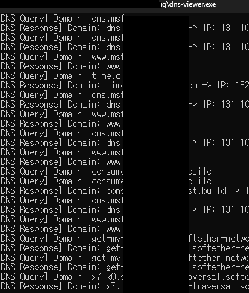

# DNS Viewer

A tool for monitoring and analyzing DNS traffic in real-time.

## Prerequisites

- Windows operating system
- Visual Studio or compatible C++ compiler
- Administrator privileges (required for packet capture)

## Installation

### 1. Clone the Repository

```bash
git clone https://github.com/somersby10ml/dns-viewer.git
cd dns-viewer
```

### 2. Install WinDivert Dependencies

1. Download **WinDivert-2.2.2-A.zip** from [https://reqrypt.org/windivert.html](https://reqrypt.org/windivert.html)
2. Extract the contents of the zip file
3. Copy all extracted files to the `libs\windivert` directory in your project folder

Your directory structure should look like this:
```
dns-viewer/
├── libs/
│   └── windivert/
│       ├── include/
│       │   └── windivert.h
│       ├── x64/
│       │   ├── WinDivert.dll
│       │   ├── WinDivert.lib
│       │   └── WinDivert64.sys
│       └── x86/
│           ├── WinDivert.dll
│           ├── WinDivert.lib
│           ├── WinDivert32.sys
│           └── WinDivert64.sys
└── ...
```

### 3. Build the Project

Compile the project using your preferred C++ compiler or IDE.

## Usage

Run the executable with administrator privileges to start monitoring DNS traffic.

## Features

- Real-time DNS traffic monitoring
- Packet analysis and filtering
- Network traffic visualization

## Requirements

- **WinDivert 2.2.2-A** - Required for packet capture functionality
- **Administrator privileges** - Necessary for low-level network access

## Screenshot



## License

This project is licensed under the terms specified in the LICENSE file.

## Contributing

Contributions are welcome! Please feel free to submit a Pull Request.